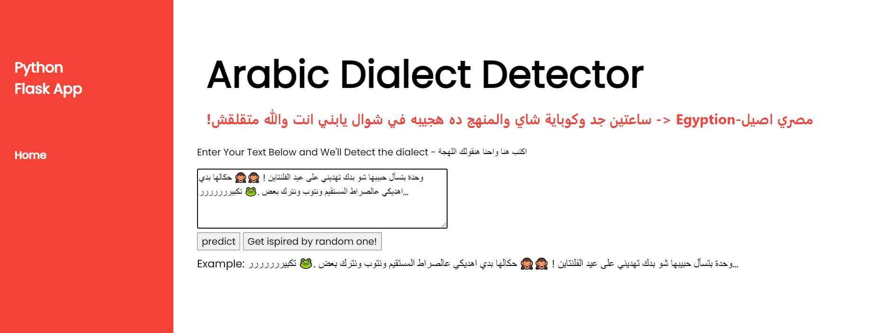
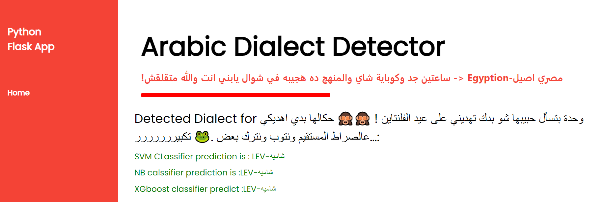
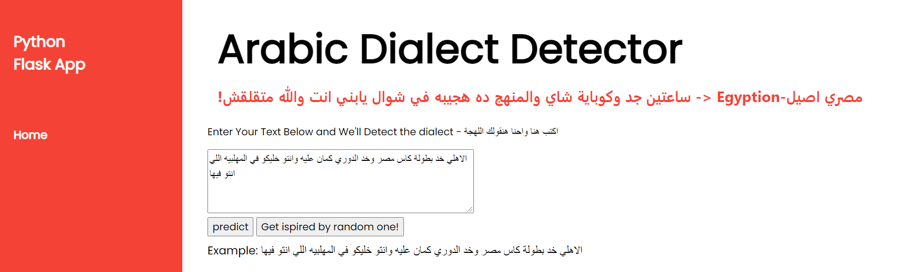
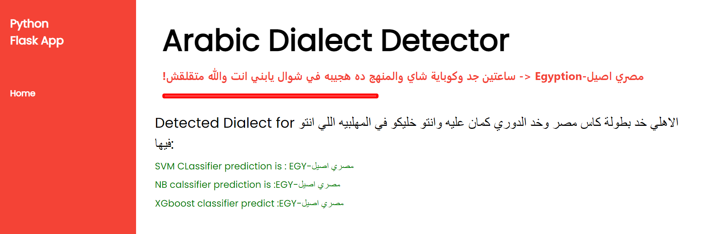
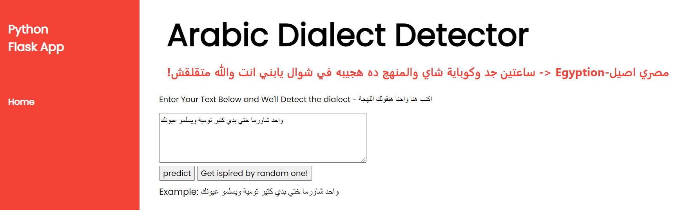
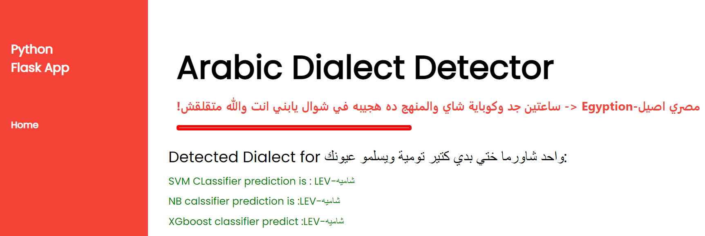

There were 2 Notebooks

preprocessing.ipynb : doing all the preprocessing steps  and the saved the data cleaned in csv format

arabic dialect model.ipynb :  prepare our data to fit it in the model  and choose the best one from 3 classifires (NB,XGBOOST,SVM)

and we used flask api to deploy our model at herouka to test it in production

or you can use the production link (updated with awsome new functions and list of unseen data that ou can test the model with it) :
https://arabic-dialect-identification2.herokuapp.com/

You can install it to test in your local network :
-install requreiment
-flask run app

screenshots from our application

#we put list of unseen data that you can try from it ot try your own

Team members :
Abdelrahman Ragab
Salma khaled
Abdelrahman Ashraf
Hagar esmat
